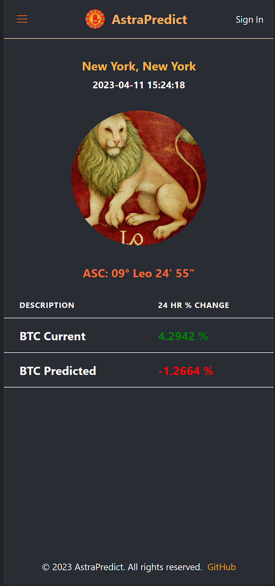

# ⭐ Astra Predict

General overview:

AstraPredict attempts to answer an ancient question:
Can the stars predict the future?

This project sets out to answer this question using machine learning to train models with historical data to see if any useful predictions can be made using the position of the planets in constellations.

The first implementation of this process is the prediction of the price of bitcoin.

The client is a simple responsive react app that returns data from the api. In a local environement, with the server running, you can train and test the model by feeding it data from the coingecko api and the planet positions data.

- A version is deployed at: https://astrapredict.vercel.app

- The links provided may be slow due to using free servicesa
