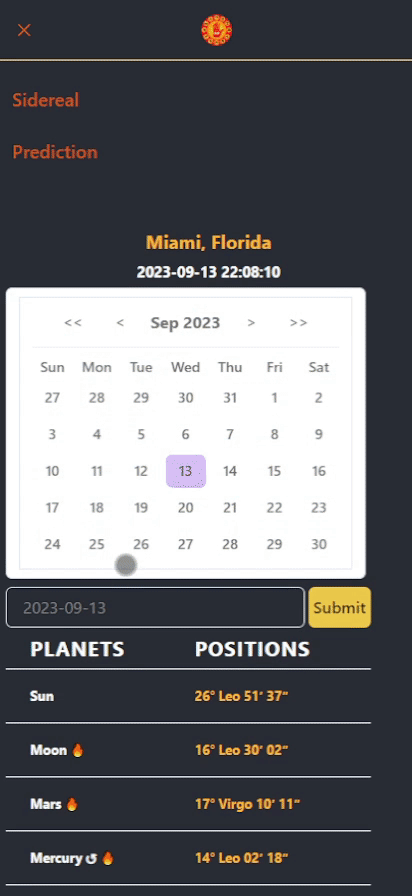
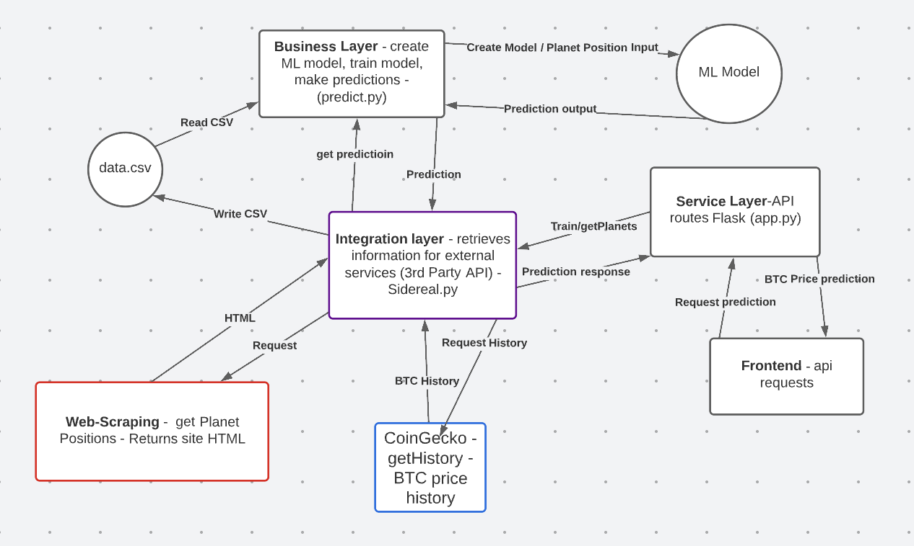

# ⭐ Astra Predict

General overview:

AstraPredict attempts to answer an ancient question:
Can the stars predict the future?

This project sets out to answer this question using machine learning to train models with historical data to see if any useful predictions can be made using the position of the planets in constellations.

Behind the scenes, the backend code whips up a machine learning model trained using the sidereal astrology position and the historical price of bitcoin. Once created, we are able to use any astrological position data to make a prediction for the bitcoin change at that time.
